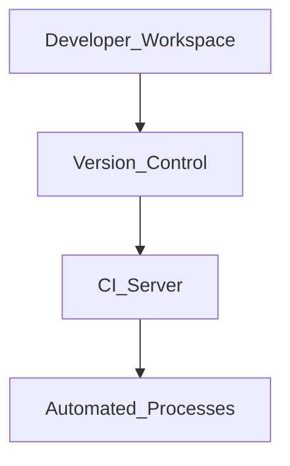
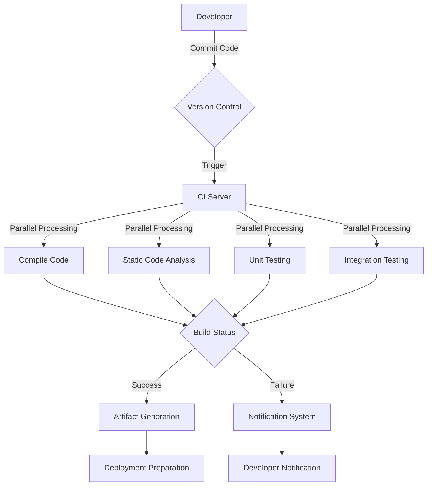
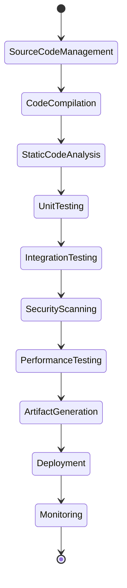
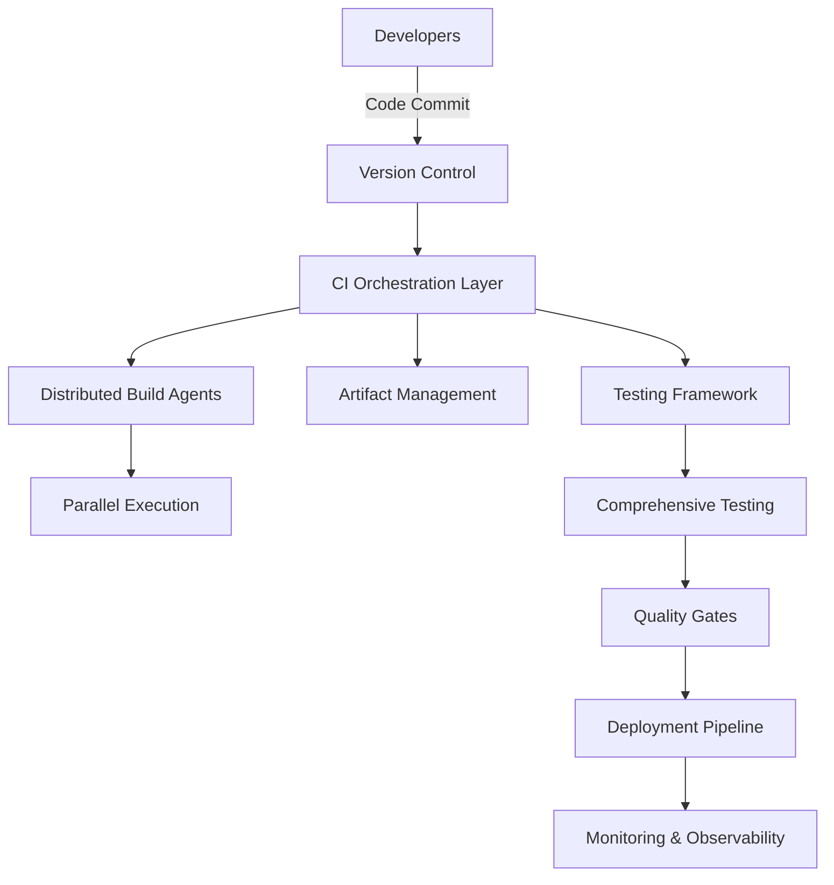
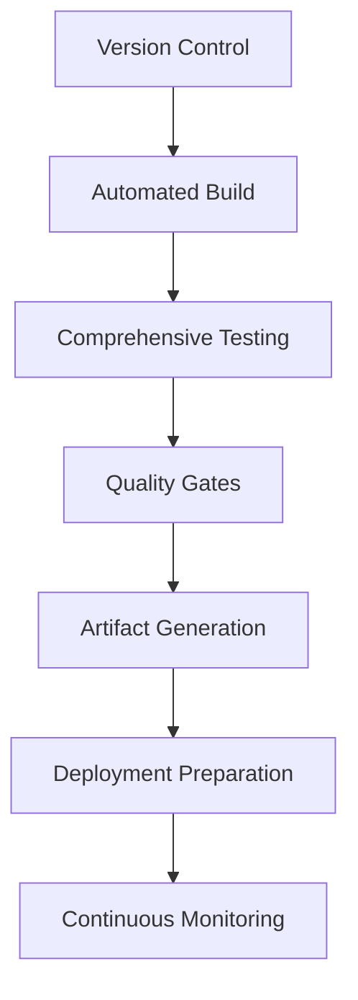

### Continuous Integration Workflow



| Component | Description |
| --- | --- |
| Developer Workspace | Where developers write code, perform local testing, and commit changes |
| Version Control (Git) | Code repository that manages branches, code review, and merge requests |
| CI Server | System that automates the build process, runs tests, and generates reports |

<br>
<br>
<br>
<hr>

### Continuous Integration (CI) Detailed Explanation

#### Core Definition
Continuous Integration is a software development practice where developers frequently merge their code changes into a central repository. Each integration is verified by automated builds and tests.

#### Key Components
1. **Version Control System**
   - Tracks code changes
   - Enables collaborative development
   - Provides rollback capabilities

2. **Automated Build Process**
   - Compiles code automatically
   - Checks for compilation errors
   - Ensures consistent build environment

3. **Automated Testing**
   - Unit tests
   - Integration tests
   - Performance tests
   - Security scans

#### Workflow Steps
1. **Code Development**
   - Developers write code locally
   - Perform initial local testing
   - Commit changes to version control

2. **Repository Integration**
   - Code pushed to shared repository
   - Triggers automated build process
   - Runs comprehensive test suite

3. **Feedback Mechanism**
   - Immediate notifications on build/test failures
   - Developers alerted to issues quickly
   - Promotes rapid problem resolution

#### Popular CI Tools
- **Jenkins**: Open-source, highly customizable
- **GitLab CI**: Integrated with GitLab repository
- **GitHub Actions**: Native GitHub workflow automation
- **CircleCI**: Cloud-based CI/CD platform
- **Travis CI**: Hosted continuous integration service

#### Sample Jenkins Pipeline Configuration
```groovy
pipeline {
    agent any
    
    stages {
        stage('Checkout') {
            steps {
                git 'https://github.com/your-repo/project.git'
            }
        }
        
        stage('Build') {
            steps {
                sh 'mvn clean compile'
            }
        }
        
        stage('Test') {
            steps {
                sh 'mvn test'
            }
        }
        
        stage('Report') {
            steps {
                junit '**/target/surefire-reports/TEST-*.xml'
            }
        }
    }
}
```

#### Benefits
- Early bug detection
- Reduced integration problems
- Faster development cycles
- Improved code quality
- Enhanced team collaboration

#### Best Practices
1. Commit code frequently
2. Write comprehensive tests
3. Fix broken builds immediately
4. Keep builds fast
5. Test in a clone of production environment


### Advanced Continuous Integration Concepts

#### Architecture and Components

1. **Version Control System**
   - Distributed vs. Centralized VCS
   - Branching Strategies
     - Feature branching
     - Trunk-based development
     - Git flow methodology

2. **CI Server Architecture**
   - Master-Agent Architecture
   - Cloud-based CI infrastructure
   - Containerized CI environments

#### Detailed Workflow Breakdown



#### Advanced CI Techniques

1. **Code Quality Checks**
   - Static Code Analysis
   - Code Coverage Metrics
   - Complexity Analysis
   - Security Vulnerability Scanning

2. **Testing Strategies**
   - Parallel Test Execution
   - Distributed Testing
   - Flaky Test Detection
   - Performance Regression Testing

#### Configuration Management

```yaml
# Example CI Configuration (GitHub Actions)
name: Comprehensive CI Pipeline

on: [push, pull_request]

jobs:
  build:
    runs-on: ubuntu-latest
    
    steps:
    - uses: actions/checkout@v3
    
    - name: Setup Python
      uses: actions/setup-python@v3
      with:
        python-version: '3.9'
    
    - name: Install Dependencies
      run: |
        python -m pip install --upgrade pip
        pip install -r requirements.txt
    
    - name: Run Linters
      run: |
        pip install flake8
        flake8 .
    
    - name: Unit Tests
      run: |
        pip install pytest
        pytest tests/
    
    - name: Security Scan
      run: |
        pip install bandit
        bandit -r .
```

#### Advanced Tool Integration

1. **CI/CD Tools**
   - Jenkins
   - GitLab CI
   - GitHub Actions
   - CircleCI
   - TeamCity

2. **Monitoring and Reporting**
   - Real-time build dashboards
   - Performance trend analysis
   - Historical build statistics

#### Performance Optimization

1. Caching Dependencies
2. Incremental Builds
3. Parallel Test Execution
4. Containerized Build Environments

#### Key Challenges and Solutions

1. **Build Performance**
   - Optimize test suite
   - Use parallel processing
   - Implement intelligent test selection

2. **Scalability**
   - Distributed build systems
   - Cloud-based CI infrastructure
   - Containerized agents

3. **Environment Consistency**
   - Docker containers
   - Infrastructure as Code
   - Consistent build environments

### Technical Recommendations

1. Implement comprehensive automated testing
2. Use declarative pipeline configurations
3. Integrate security scanning
4. Monitor and optimize build times
5. Maintain clean, modular code structure


<br>
<br>
<br>
<hr>


### Advanced Continuous Integration Deep Dive

#### Technical Architecture

1. **Integration Patterns**
   - Centralized Integration
   - Decentralized Integration
   - Hybrid Integration Models

2. **Architectural Components**
   - Version Control System
   - Build Automation Engine
   - Test Execution Framework
   - Artifact Repository
   - Notification System

#### Comprehensive CI Workflow



#### Advanced Implementation Techniques

1. **Build Optimization Strategies**
   - Incremental Compilation
   - Dependency Caching
   - Parallel Test Execution
   - Distributed Build Systems

2. **Code Quality Enforcement**
   ```yaml
   quality-gates:
     code-coverage: 80%
     complexity-threshold: 10
     duplicate-code-limit: 5%
     static-analysis-rules:
       - prevent-critical-warnings
       - enforce-best-practices
   ```

#### Comprehensive Testing Approach

1. **Testing Pyramid**
   - Unit Tests (Bottom Layer)
   - Integration Tests (Middle Layer)
   - End-to-End Tests (Top Layer)

2. **Test Coverage Types**
   - Static Code Analysis
   - Unit Testing
   - Integration Testing
   - Performance Testing
   - Security Testing
   - Compatibility Testing

#### CI Configuration Example

```yaml
# Advanced CI Pipeline Configuration
ci-pipeline:
  stages:
    - validate
    - compile
    - test
    - analyze
    - package
    - deploy

  validation-checks:
    - code-formatting
    - syntax-verification
    - dependency-audit

  compilation:
    strategies:
      - incremental-build
      - parallel-compilation
    
  testing:
    parallel-execution: true
    coverage-minimum: 85%
    timeout: 30m
```

#### Advanced Tools Ecosystem

1. **CI/CD Platforms**
   - Jenkins
   - GitLab CI/CD
   - GitHub Actions
   - CircleCI
   - Azure DevOps
   - TravisCI

2. **Monitoring Tools**
   - Prometheus
   - Grafana
   - ELK Stack
   - Datadog

#### Performance Optimization Techniques

1. Caching Build Dependencies
2. Incremental Compilation
3. Parallel Test Execution
4. Container-Based Build Environments
5. Intelligent Test Selection

#### Security Integration

1. **Static Application Security Testing (SAST)**
   - Code vulnerability scanning
   - Dependency check
   - Compliance verification

2. **Dynamic Application Security Testing (DAST)**
   - Runtime vulnerability detection
   - Penetration testing integration

#### Advanced Metrics and Reporting

```python
class CIMetricsCollector:
    def collect_build_metrics(self):
        return {
            'build_time': self.calculate_build_duration(),
            'test_coverage': self.calculate_test_coverage(),
            'failure_rate': self.calculate_failure_percentage(),
            'code_quality_score': self.analyze_code_quality()
        }
```

#### Best Practices

1. Implement comprehensive automated testing
2. Use declarative pipeline configurations
3. Integrate security scanning
4. Monitor and optimize build times
5. Maintain clean, modular code structure
6. Implement feature flag mechanisms
7. Use ephemeral build environments

### Emerging Trends

1. AI-Powered Testing
2. Self-Healing CI Pipelines
3. Serverless CI/CD
4. Machine Learning-Driven Optimization


<br>
<br>
<br>
<hr>


### Advanced Continuous Integration Ecosystem

#### Architectural Evolution

1. **Modern CI Architecture**
   - Microservices-based CI infrastructure
   - Cloud-native CI platforms
   - Containerized build environments
   - Serverless CI execution

2. **Infrastructure Components**
   ```mermaid
   graph TD
       A[Version Control] --> B[CI/CD Orchestrator]
       B --> C[Build Agents]
       B --> D[Artifact Repository]
       B --> E[Testing Framework]
       B --> F[Deployment Managers]
       G[Monitoring Systems] <--> B
   ```

#### Comprehensive CI Implementation Strategy

1. **Pipeline Configuration**
```yaml
ci-pipeline:
  stages:
    - source-validation
    - compilation
    - testing
    - security-scanning
    - artifact-generation
    - deployment
  
  configuration-management:
    - infrastructure-as-code
    - environment-segregation
    - dynamic-configuration
```

2. **Advanced Testing Approaches**
   - Mutation Testing
   - Chaos Engineering
   - Property-Based Testing
   - Contract Testing
   - Behavior-Driven Development (BDD)

#### Technical Implementation Patterns

1. **Build Optimization**
```python
class CIOptimizer:
    def optimize_build_pipeline(self):
        strategies = [
            'incremental-compilation',
            'parallel-execution',
            'intelligent-caching',
            'dynamic-test-selection'
        ]
        return self.apply_optimization_strategies(strategies)
```

2. **Quality Gates**
```yaml
quality-enforcement:
  code-coverage:
    minimum: 85%
  complexity-limits:
    cyclomatic-complexity: 10
  security-scanning:
    critical-vulnerabilities: 0
```

#### Advanced Tools and Integration

1. **CI/CD Ecosystem**
   - Jenkins X
   - Spinnaker
   - Tekton
   - ArgoCD
   - Flux

2. **Monitoring and Observability**
   - Prometheus
   - Grafana
   - OpenTelemetry
   - ELK Stack

#### Performance and Scalability

1. **Distributed Build Systems**
   - Horizontal scaling
   - Dynamic agent provisioning
   - Cloud-based build infrastructure

2. **Resource Management**
```yaml
resource-allocation:
  build-agents:
    auto-scaling: true
    max-concurrent-jobs: 50
    priority-based-scheduling: enabled
```

#### Security Integration

1. **Advanced Security Scanning**
   - Static Application Security Testing (SAST)
   - Dynamic Application Security Testing (DAST)
   - Software Composition Analysis (SCA)
   - Runtime Application Self-Protection (RASP)

2. **Compliance Verification**
```python
class ComplianceValidator:
    def validate_ci_pipeline(self):
        checks = [
            'regulatory-compliance',
            'security-standards',
            'data-protection-rules'
        ]
        return self.perform_comprehensive_validation(checks)
```

#### Emerging Trends

1. Machine Learning-Driven CI Optimization
2. AI-Powered Testing
3. Self-Healing Infrastructure
4. Predictive Build Performance

#### Strategic Recommendations

1. Implement comprehensive automated testing
2. Use declarative pipeline configurations
3. Integrate continuous security scanning
4. Optimize build and test performance
5. Maintain modular, clean code architecture


<br>
<br>
<br>
<hr>


### Continuous Integration: Advanced Technical Mastery

#### Architectural Evolution

1. **Modern CI Architectural Paradigms**
   - Cloud-native CI infrastructure
   - Serverless build environments
   - Microservices-based CI platforms
   - Event-driven pipeline architectures

2. **Advanced Architecture Diagram**


#### Comprehensive Implementation Strategy

1. **Advanced Pipeline Configuration**
```yaml
ci-pipeline:
  configuration:
    - adaptive-scaling
    - intelligent-routing
    - self-healing-mechanisms
  
  stages:
    - source-validation
    - compilation
    - comprehensive-testing
    - security-analysis
    - artifact-generation
    - deployment-preparation
```

2. **Intelligent Testing Ecosystem**
   - Mutation Testing
   - Property-Based Testing
   - Generative Testing
   - Chaos Engineering
   - Contract Testing

#### Technical Implementation Patterns

1. **Advanced Build Optimization**
```python
class CIPerformanceOptimizer:
    def optimize_pipeline(self):
        optimization_strategies = [
            'incremental-compilation',
            'parallel-execution',
            'intelligent-caching',
            'dynamic-test-selection',
            'predictive-failure-detection'
        ]
        return self.apply_advanced_optimizations(optimization_strategies)
```

2. **Quality Enforcement Mechanism**
```yaml
quality-gates:
  code-coverage:
    minimum: 85%
  complexity-constraints:
    cyclomatic-complexity: 
      max-threshold: 10
  security-scanning:
    critical-vulnerabilities: 0
    mandatory-checks:
      - dependency-audit
      - static-code-analysis
```

#### Advanced Tools Ecosystem

1. **CI/CD Platforms**
   - Tekton
   - Jenkins X
   - ArgoCD
   - Spinnaker
   - GitOps Workflows

2. **Observability Stack**
   - OpenTelemetry
   - Prometheus
   - Grafana
   - Distributed Tracing
   - Advanced Logging Mechanisms

#### Security and Compliance Integration

1. **Comprehensive Security Framework**
   - SAST (Static Application Security Testing)
   - DAST (Dynamic Application Security Testing)
   - SCA (Software Composition Analysis)
   - Runtime Application Self-Protection

2. **Compliance Validation**
```python
class ComplianceEngine:
    def validate_pipeline_compliance(self):
        compliance_checks = [
            'regulatory-standards',
            'industry-specific-regulations',
            'data-protection-protocols',
            'security-best-practices'
        ]
        return self.execute_comprehensive_validation(compliance_checks)
```

#### Emerging Technological Trends

1. AI-Driven CI Optimization
2. Machine Learning Predictive Testing
3. Autonomous Infrastructure Management
4. Self-Healing CI Pipelines

#### Strategic Recommendations

1. Implement comprehensive automated testing
2. Use declarative, adaptive pipeline configurations
3. Integrate continuous security scanning
4. Focus on build and test performance optimization
5. Maintain modular, clean code architecture

### Next-Generation CI Capabilities

1. **Intelligent Test Selection**
   - Machine learning-powered test prioritization
   - Predictive failure detection
   - Dynamic test suite optimization

2. **Adaptive Infrastructure**
   - Auto-scaling build environments
   - Resource-aware execution
   - Cost-optimized infrastructure management

#### Performance Metrics and Tracking

```python
class CIPerformanceMetrics:
    def collect_pipeline_insights(self):
        return {
            'build_time': self.calculate_build_duration(),
            'test_coverage': self.analyze_test_coverage(),
            'failure_rate': self.compute_failure_percentage(),
            'resource_utilization': self.measure_infrastructure_efficiency()
        }
```


### Continuous Integration: Comprehensive Conclusion

#### Final Synthesis of CI Principles

1. **Core Purpose**
   - Rapid, reliable software integration
   - Early defect detection
   - Continuous code quality maintenance

2. **Key Success Factors**
   - Automated testing
   - Frequent code commits
   - Comprehensive build processes
   - Immediate feedback mechanisms

#### Strategic Implementation Framework



#### Critical Best Practices

1. Implement comprehensive automated testing
2. Maintain clean, modular code architecture
3. Use declarative pipeline configurations
4. Integrate continuous security scanning
5. Optimize build and test performance

#### Technology Ecosystem

- **Version Control**: Git, SVN
- **CI Platforms**: Jenkins, GitLab CI, GitHub Actions
- **Testing Frameworks**: JUnit, Selenium, Pytest
- **Monitoring**: Prometheus, Grafana

#### Maturity Model

```
Level 1: Basic Integration
Level 2: Automated Testing
Level 3: Comprehensive Quality Gates
Level 4: Advanced Security Integration
Level 5: Predictive, AI-Driven CI
```

#### Future Trajectory

1. AI-Powered Optimization
2. Self-Healing Infrastructures
3. Intelligent Test Selection
4. Serverless CI Architectures

#### Final Recommendations

1. Continuously evolve CI practices
2. Invest in automation
3. Prioritize code quality
4. Embrace technological innovations
5. Foster a culture of continuous improvement

