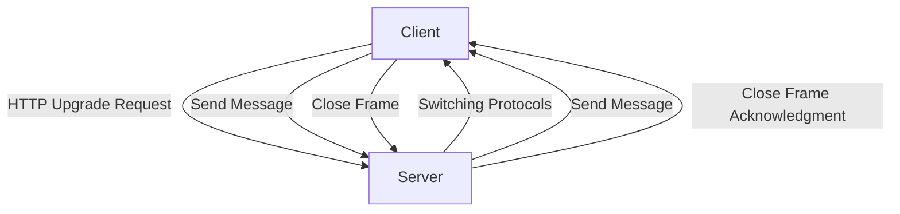
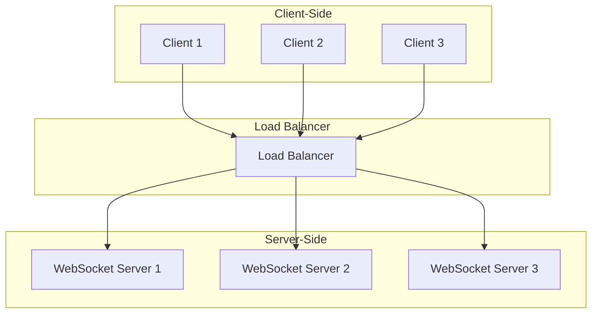

# Comprehensive Guide to WebSocket Technology

## Evolution of WebSocket Technology
WebSocket technology emerged in 2011 as part of the HTML5 specification, designed to overcome the limitations of traditional HTTP-based communication. Before WebSockets, real-time communication relied on techniques like long polling, where clients repeatedly requested updates from the server. These approaches were inefficient and introduced significant latency and resource overhead.

WebSockets introduced a bidirectional, full-duplex communication channel over a single TCP connection, enabling real-time data exchange with minimal latency. This innovation was driven by the need for responsive web applications in domains like gaming, financial trading, and collaborative tools. Over the years, WebSockets have been standardized (RFC 6455) and adopted widely, with libraries and frameworks making integration easier across programming languages.

---

## Core Architecture and Design Principles
The WebSocket protocol operates on the following principles:

1. **Handshake Process**:
   - Initiated via an HTTP/1.1 request to establish a WebSocket connection.
   - Upgraded to WebSocket if the server responds with a status code 101.

2. **Full-Duplex Communication**:
   - Both client and server can send and receive messages independently over the same connection.

3. **Lightweight Messaging**:
   - Messages are exchanged in a compact binary or text format, reducing bandwidth usage.

4. **Persistence**:
   - Connections remain open, avoiding the need to re-establish communication repeatedly.

5. **Low Latency**:
   - Designed for near-instantaneous data exchange, ideal for real-time applications.

6. **Error Handling and Close Frames**:
   - Graceful connection termination using close frames and robust error handling mechanisms.

### WebSocket Architecture Diagram


### WebSocket with Load Balancing


---

## Base Code Models for WebSocket Implementation
### Server-Side Implementation (Node.js)
```javascript
const WebSocket = require('ws');

const server = new WebSocket.Server({ port: 8080 });

server.on('connection', (socket) => {
  console.log('Client connected');

  // Handle incoming messages
  socket.on('message', (message) => {
    console.log(`Received: ${message}`);
    socket.send(`Echo: ${message}`); // Echo message back to the client
  });

  // Handle client disconnection
  socket.on('close', () => {
    console.log('Client disconnected');
  });
});

console.log('WebSocket server is running on ws://localhost:8080');
```

### Client-Side Implementation (JavaScript)
```javascript
const socket = new WebSocket('ws://localhost:8080');

socket.onopen = () => {
  console.log('Connected to the server');
  socket.send('Hello, server!');
};

socket.onmessage = (event) => {
  console.log(`Message from server: ${event.data}`);
};

socket.onclose = () => {
  console.log('Disconnected from the server');
};

socket.onerror = (error) => {
  console.error('WebSocket error:', error);
};
```

---

## Initialization or Initial Burst Code
When establishing a WebSocket connection, the client sends an HTTP request with specific headers:

### HTTP Request (Upgrade)
```
GET /chat HTTP/1.1
Host: server.example.com
Upgrade: websocket
Connection: Upgrade
Sec-WebSocket-Key: dGhlIHNhbXBsZSBub25jZQ==
Sec-WebSocket-Version: 13
```

### HTTP Response
```
HTTP/1.1 101 Switching Protocols
Upgrade: websocket
Connection: Upgrade
Sec-WebSocket-Accept: s3pPLMBiTxaQ9kYGzzhZRbK+xOo=
```
The `Sec-WebSocket-Accept` header is derived from the `Sec-WebSocket-Key` using SHA-1 hashing and Base64 encoding.

---

## Key Features of WebSocket
- **Bidirectional Communication**: Real-time interaction between client and server.
- **Low Latency**: Minimal overhead and fast data exchange.
- **Persistent Connections**: Reduced resource consumption by avoiding repetitive handshakes.
- **Binary and Text Support**: Handles both data formats seamlessly.
- **Lightweight Protocol**: Compact message framing.
- **Subprotocols**: Custom protocols for application-specific messaging.
- **Cross-Origin Communication**: Supports secure cross-domain communication with CORS.

---

## Competitors and Alternatives to WebSocket
- **Server-Sent Events (SSE)**:
  - Unidirectional (server to client) communication.
  - Suitable for live feeds or notifications.

- **HTTP/2**:
  - Multiplexed streams over a single connection.
  - Better suited for modern HTTP-based communication.

- **GraphQL Subscriptions**:
  - Built on WebSocket or other protocols for real-time queries.

- **MQTT**:
  - Lightweight protocol optimized for IoT devices.

---

## Use Cases Across Industries
1. **Finance**:
   - Real-time stock trading platforms.
   - Live market data feeds.

2. **Gaming**:
   - Multiplayer game state synchronization.

3. **IoT**:
   - Device-to-cloud communication.
   - Real-time telemetry data.

4. **Collaborative Tools**:
   - Live document editing.
   - Chat applications.

5. **Streaming Services**:
   - Live video or audio feeds.

---

## Benefits of Using WebSocket
- Real-time interaction.
- Bandwidth efficiency.
- Lower latency compared to polling techniques.
- Scalability for large-scale applications.
- Standardized protocol supported by major browsers and platforms.

---

## Disadvantages and Limitations
- **Complexity**: Requires additional effort to manage connections and handle errors.
- **Compatibility**: Older browsers may lack support.
- **Firewall Restrictions**: Some corporate networks block WebSocket traffic.
- **Resource Consumption**: Persistent connections can strain server resources.
- **Security Risks**: Susceptible to attacks like DoS if not implemented securely.

---

## Future Trends and Advancements
1. **Integration with HTTP/3**:
   - Leveraging QUIC for faster and more reliable connections.

2. **Enhanced Security**:
   - Better encryption and authentication mechanisms.

3. **Edge Computing**:
   - Real-time processing closer to users.

4. **Hybrid Protocols**:
   - Combining WebSocket with other real-time technologies like WebRTC.

5. **Library Enhancements**:
   - Frameworks like Socket.IO and SignalR simplifying real-time application development.

---

## Additional Topics to Explore

### Load Balancing and Scalability
To deploy WebSocket servers at scale, the following strategies are effective:

- **Sticky Sessions**: Ensure a client is always routed to the same server for a persistent connection. This can be achieved using session affinity in load balancers.
- **Horizontal Scaling**: Deploy multiple WebSocket servers and use load balancers to distribute connections among them.
- **Message Brokers**: Use a message broker like Redis or Kafka to share state and messages between servers.
- **Containerization**: Deploy WebSocket servers in containers orchestrated by Kubernetes to simplify scaling and failover.
- **Health Checks**: Ensure load balancers only route traffic to healthy servers.

### Monitoring and Debugging
Monitoring tools can help analyze WebSocket traffic and diagnose issues:

- **Wireshark**: Capture and analyze WebSocket packets.
- **Chrome DevTools**: Inspect WebSocket frames in the Network tab.
- **Prometheus and Grafana**: Collect and visualize WebSocket server metrics.
- **Log Aggregation Tools**: Use tools like ELK Stack (Elasticsearch, Logstash, Kibana) to centralize and analyze logs.
- **Custom Dashboards**: Build dashboards to track connection counts, message rates, and error rates.

### Protocol Comparison
#### WebSocket vs HTTP/2 vs MQTT
- **WebSocket**:
  - Strengths: Full-duplex, low-latency, real-time communication over a single TCP connection.
  - Ideal Use Cases: Chat applications, gaming, and collaborative tools.
  - Limitations: Relies on persistent connections, potentially increasing server resource use.

- **HTTP/2**:
  - Strengths: Multiplexed streams, header compression, and server push capabilities.
  - Ideal Use Cases: Standard web communication and improved HTTP performance for traditional APIs.
  - Limitations: Primarily request-response oriented; lacks inherent bidirectional capabilities.

- **MQTT**:
  - Strengths: Lightweight protocol optimized for constrained devices with publish/subscribe messaging patterns.
  - Ideal Use Cases: IoT devices, telemetry data, and remote monitoring.
  - Limitations: Requires a broker for message routing, less suited for browser-based applications.

### Advanced Features
1. **Subprotocols**:
   - WebSocket supports subprotocols for defining custom messaging rules (e.g., STOMP, WAMP).
   - Example implementation:
     ```javascript
     const socket = new WebSocket('ws://example.com', ['subprotocol']);
     socket.onopen = () => console.log('Subprotocol in use:', socket.protocol);
     ```

2. **Message Compression**:
   - Use compression extensions like `permessage-deflate` to reduce message sizes.
   - Example configuration with Node.js:
     ```javascript
     const server = new WebSocket.Server({
       port: 8080,
       perMessageDeflate: true,
     });
     ```

### Security Best Practices

1. **Secure Connection**:
   - Always use `wss://` (WebSocket Secure) for encrypted communication over TLS (Transport Layer Security).
   - This ensures data is protected from interception during transmission.
   - Example:
     ```javascript
     const socket = new WebSocket('wss://example.com');
     ```

2. **Authentication**:
   - Implement token-based or session-based authentication to validate clients before establishing a connection.
   - Use JWT (JSON Web Tokens) or OAuth tokens for secure authentication.
   - Example:
     ```javascript
     const token = 'your-jwt-token';
     const socket = new WebSocket(`wss://example.com?token=${token}`);
     ```

3. **Rate Limiting**:
   - Prevent abuse by limiting the number of connections or messages from a single client.
   - Use middleware or external tools to track and enforce limits.
   - Example with Node.js:
     ```javascript
     const rateLimit = require('express-rate-limit');

     const limiter = rateLimit({
       windowMs: 60 * 1000, // 1 minute
       max: 100, // limit each client to 100 messages per minute
     });
     app.use('/ws', limiter);
     ```

4. **Input Validation**:
   - Sanitize and validate incoming messages to prevent injection attacks or malformed payloads.
   - Use libraries like Joi or custom validation rules.
   - Example:
     ```javascript
     const Joi = require('joi');

     const messageSchema = Joi.object({
       type: Joi.string().valid('chat', 'update').required(),
       content: Joi.string().max(500).required(),
     });

     socket.on('message', (message) => {
       const validation = messageSchema.validate(JSON.parse(message));
       if (validation.error) {
         console.error('Invalid message:', validation.error);
         return;
       }
       console.log('Valid message:', message);
     });
     ```

5. **Cross-Origin Restrictions**:
   - Configure CORS (Cross-Origin Resource Sharing) policies to restrict access to trusted domains.
   - Example with Node.js:
     ```javascript
     const WebSocket = require('ws');
     const server = new WebSocket.Server({ port: 8080 });

     server.on('headers', (headers, request) => {
       headers.push('Access-Control-Allow-Origin: https://trusted-origin.com');
     });
     ```

By following these best practices, you can ensure that your WebSocket implementation is robust, secure, and reliable for real-time applications.

