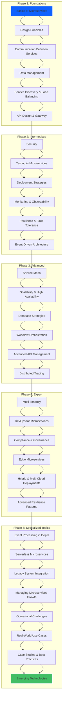

```mermaid

graph TD
  A[Basics of Microservices] --> B[Design Principles]
  B --> C[Communication Between Services]
  C --> D[Data Management]
  D --> E[Service Discovery & Load Balancing]
  E --> F[API Design & Gateway]
  F --> G[Security]
  G --> H[Testing in Microservices]
  H --> I[Deployment Strategies]

  I --> J[Monitoring & Observability]
  J --> K[Resilience & Fault Tolerance]
  K --> L[Event-Driven Architecture]
  L --> M[Service Mesh]
  M --> N[Scalability & High Availability]
  
  N --> O[Database Strategies]
  O --> P[Workflow Orchestration]
  P --> Q[Advanced API Management]
  Q --> R[Distributed Tracing]
  R --> S[Multi-Tenancy]
  
  S --> T[DevOps for Microservices]
  T --> U[Compliance & Governance]
  U --> V[Edge Microservices]
  V --> W[Hybrid & Multi-Cloud Deployments]
  
  W --> X[Advanced Resilience Patterns]
  X --> Y[Event Processing in Depth]
  Y --> Z[Serverless Microservices]
  
  Z --> AA[Legacy System Integration]
  AA --> AB[Managing Microservices Growth]
  AB --> AC[Operational Challenges]
  
  AC --> AD[Real-World Use Cases]
  AD --> AE[Case Studies & Best Practices]
  AE --> AF[Emerging Technologies]

  style A fill:#0f62fe,stroke:#ffffff,stroke-width:2px
  style AF fill:#42be65,stroke:#ffffff,stroke-width:2px
  subgraph Phase 1: Foundations
    A --> B --> C --> D --> E --> F
  end
  subgraph Phase 2: Intermediate
    G --> H --> I --> J --> K --> L
  end
  subgraph Phase 3: Advanced
    M --> N --> O --> P --> Q --> R
  end
  subgraph Phase 4: Expert
    S --> T --> U --> V --> W --> X
  end
  subgraph Phase 5: Specialized Topics
    Y --> Z --> AA --> AB --> AC --> AD --> AE --> AF
  end

```
